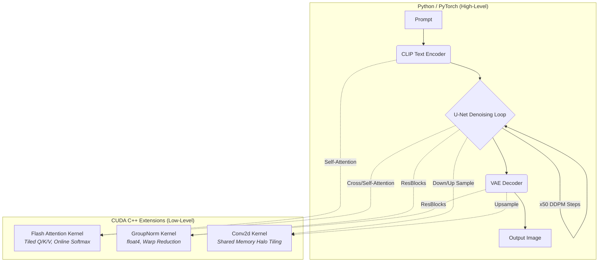

# Diffusion.cu

<div align="center">
  <p><strong>A high-performance Latent Diffusion Model built from scratch, featuring bespoke CUDA kernels for core network primitives.</strong></p>
</div>

---

## 📖 Overview

**Diffusion.cu** is a from-scratch implementation of a Latent Diffusion Model (the architecture underpinning Stable Diffusion), bridging the gap between high-level PyTorch semantics and low-level GPU execution. 

While modern deep learning frameworks abstract away hardware execution, operations like convolution, normalization, and attention are heavily memory-bandwidth bound. This project strips away those abstractions, replacing the three most compute-intensive PyTorch primitives with **hand-written, highly optimized CUDA kernels** compiled as C++ extensions via `pybind11`:

1. **GroupNorm**: Memory-bound statistics and normalization.
2. **Conv2d (3x3)**: Shared-memory tiled convolution.
3. **Multi-Head Attention**: Flash Attention with online softmax.

The result is a deep, architectural dive into GPU memory hierarchies, warp-level programming, and performance optimization for generative AI.

---

## 🏗️ System Architecture

The pipeline follows the standard Latent Diffusion (Stable Diffusion) architecture, built entirely from scratch in Python, with the heavy lifting delegated to custom CUDA kernels.



### Components
*   **CLIP Text Encoder**: 12-layer Transformer converting tokenized prompts to `(B, 77, 768)` context tensors.
*   **U-Net**: Iterative denoising network (downsampling 320→640→1280 channels, bottleneck, symmetric upsampling).
*   **VAE Decoder**: Upsamples the 64x64 latent tensor back to a 512x512 pixel image space.
*   **DDPM Sampler**: Denoising Diffusion Probabilistic Models scheduling with classifier-free guidance.

---

## ⚡ Performance Engineering & Kernel Design

The core contribution of this project lies in the bespoke CUDA kernels designed to overcome PyTorch's generic kernel overhead on targeted hardware (NVIDIA P100 / Compute 6.0).

### 1. GroupNorm (1.85x Speedup over PyTorch)
GroupNorm is fundamentally a memory-bandwidth-bound operation. The custom kernel (`groupnorm.cu`) achieves a **1.85x speedup** through:
*   **Vectorized Memory Access**: Utilizing `float4` (128-bit) loads/stores to saturate the memory bus, nearly doubling effective bandwidth on aligned data.
*   **Two-Phase Warp Reduction**: Instead of synchronizing the entire thread block (`__syncthreads`), it utilizes Cooperative Groups (`cg::reduce`) mapping to hardware-accelerated shuffle instructions (`__shfl_xor`). 
*   **Single-Kernel Fusion**: Fuses the statistics computation (mean/variance) and the normalization pass into a single kernel launch, eliminating a costly round-trip to global memory (HBM).

### 2. Conv2d 3x3 
*   **Shared Memory Tiling**: Tiles the input into shared memory with a halo region, allowing threads to process the 3x3 filter without redundant global memory reads.
*   **Design Trade-off (Occupancy vs. Contention)**: To prevent exceeding the 48KB shared-memory limit per SM (e.g., in the 1280-channel U-Net bottleneck), input channels are chunked into groups of 16. Partial sums are accumulated in global memory via `atomicAdd`. While atomics can cause contention, the L2 cache largely absorbs this traffic, yielding faster execution on Pascal architectures compared to launching a secondary reduction kernel.

### 3. Flash Attention
*   **Online Softmax**: Computes attention without materializing the full `S x S` score matrix in global memory. Only `TILE_KV` scores live in registers at any given time.
*   **Custom Layout Control**: Operates directly on the `(B, S, H, D)` tensor layout, avoiding the transpose overhead required by generic libraries.
*   **Warp-Level Dot Product**: Distributes the D-dimension across 32 lanes of a warp, using `__shfl_xor` for reduction without requiring shared memory.

---

## 🛠️ Build & Setup

### Prerequisites
*   NVIDIA GPU (Currently optimized for Pascal/Compute 6.0 - P100. Update `CMAKE_CUDA_ARCHITECTURES` in `CMakeLists.txt` for your specific GPU).
*   CUDA Toolkit (11.x or 12.x)
*   PyTorch (C++ frontend accessible)
*   CMake (>= 3.18)
*   pybind11

### Compilation

The custom kernels are built as shared-object PyTorch C++ extensions.

```bash
# Clone the repository
git clone https://github.com/sagar0x0/Diffusion.cu.git
cd Diffusion.cu

# Create build directory
mkdir build && cd build

# Configure and compile
cmake ..
make -j$(nproc)
```

This will generate the `.so` files (`flash_atten_kernel.so`, `groupNorm_kernel.so`, `Conv2d_cuda_kernel.so`) in the `build/` directory, which can be imported directly into Python.

### Usage
See `demo.ipynb` for an end-to-end walkthrough of loading the pretrained weights and running the inference pipeline utilizing the compiled CUDA kernels.

---

## 🔮 Roadmap & Future Work

While currently serving as a highly optimized inference engine, future development paths include:

*   **FP16 / Mixed Precision Support**: Migrating kernels from `float32` to `__half` using `__hfma2`. This will double arithmetic throughput and halve memory traffic, presenting the highest-impact optimization for inference latency.
*   **Backward Passes for Training**: The current Flash Attention kernel is forward-only. Implementing the backward pass by saving `O(S)` LSE (log-sum-exp) metadata would enable the pipeline for fine-tuning.
*   **Nsight Compute Profiling Pass**: Conducting rigorous profiling via NVIDIA Nsight Compute to obtain exact metrics on achieved occupancy, warp stall reasons, and memory-bank conflicts, converting heuristic tile sizes into data-driven constants.

---
*Developed for deep exploration of GPU architecture and low-level generative AI optimization.*
